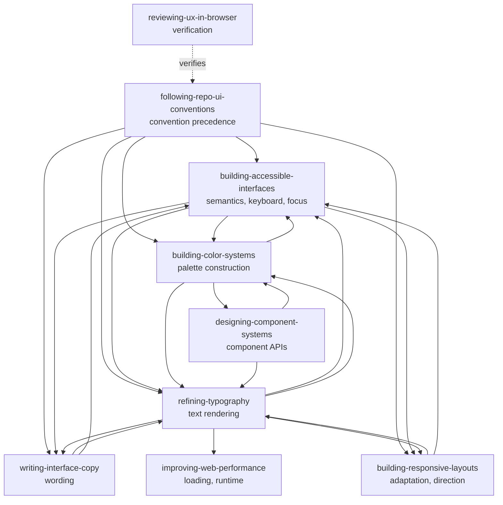

# Agent Skills

Consolidated agent skills for this workspace. Each skill is a directory holding a
`SKILL.md` entry point and optional companion files.

Skills are discovered by name and description, so a skill earns its place by being
findable at the moment it is needed and by owning its rules outright.

## Layout

```
<skill-name>/
  SKILL.md          entry point, required
  references/       lookup material read on demand
  prompts/          subagent templates
  scripts/          executables
  examples/         worked examples
```

`SKILL.md` frontmatter carries `name` (matching the directory) and `description`.
A description is third person and opens with its trigger, normally "Use when..."
and "Use before..." for a skill that runs ahead of the trigger rather than in
response to it. That opening is what routes work here, so it is load-bearing rather
than stylistic. Optional `uses:` records sibling skills the body names, with the
source repository each came from.

Authoring rules live in `writing-skills`. Adversarial testing lives in
`testing-skills`.

## What belongs here

This repository consolidates **cross-cutting craft knowledge**: rules that apply
across projects and stacks, and that several upstream sources each state slightly
differently. Consolidating them removes that redundancy and gives one consistent
voice, one home per rule, and one place to correct a mistake.

**Vendor tool skills do not belong here.** A skill describing a vendor's own tool,
framework, or API is that vendor's to maintain, and it changes when their product
changes. Install those from the vendor and let them own the truth. Forking one into
this repository buys a maintenance burden and guarantees staleness.

| Belongs here | Install from the vendor |
| --- | --- |
| Accessibility, layout, typography, color, copy | Framework and library skills |
| Review, planning, debugging, testing workflow | Design-tool and IDE integrations |
| Repository conventions and process | CLI and API surfaces owned by their publisher |

## One home per rule

Each rule lives in exactly one skill. Siblings name the owner rather than restating
it, because a rule stated twice drifts in one copy and goes stale in the other.
Where a concern crosses domains, the owning skill keeps the rule and the others
state only the hand-off.

Current UI ownership boundaries:

| Skill | Owns |
| --- | --- |
| `building-accessible-interfaces` | Semantics, keyboard, focus, forms, targets, motion requirements, whether contrast is required |
| `building-responsive-layouts` | Responsive adaptation, overlay stability, stacking order, safe areas, direction and locale resilience |
| `building-color-systems` | Ramp construction, color token tiers, notation and gamut, measuring rendered pairs, dark-mode palettes |
| `refining-typography` | Text rendering: scale, line-height, measure, wrapping, truncation, numerals, font faces |
| `writing-interface-copy` | User-facing wording: labels, errors, empty states, terminology, translation-safe strings |
| `designing-component-systems` | Component APIs, composition, state ownership, token consumption |
| `following-repo-ui-conventions` | Repository convention precedence, theme safety, styling discipline |
| `improving-web-performance` | Loading, runtime responsiveness, visual stability, resilience |
| `reviewing-ux-in-browser` | Browser verification procedure |

How the UI skills compose. A solid arrow means "defers this concern to", declared in
the source skill's `uses:` block and stated in its hand-off line. The one dashed arrow
means "verifies", which is a procedure relationship rather than a deferral and carries
no `uses:` entry in either direction:



`following-repo-ui-conventions` is the entry point and takes no inbound deferral on
purpose: repository conventions outrank every sibling rule, so no skill hands its
rules upward. `reviewing-ux-in-browser` is a procedure rather than a domain, so it
verifies the others rather than owning rules they defer to it, which is why its one
arrow is dashed.

## Upstream tracking

`provenance.json` at the repository root records, for every skill, where it came
from and the exact upstream commit it was taken at. Each file carries a SHA-256 of
its current bytes plus the upstream status: `identical`, `diverged`, `added-locally`,
`rewritten`, or `native`.

Upstream bytes are not vendored into this repository. They are fetched on demand at
the pinned commit, and the recorded hash verifies what comes back, so a drift check
does not have to trust the network.

This exists so an upstream can be re-merged deliberately and periodically. Re-merge
means fetching the current upstream, diffing it against the pinned commit, reading
what changed, and deciding. It is not an overwrite. A skill marked `rewritten` was
rebuilt in this repository's voice, so upstream changes are input to judgement rather
than a patch to apply.

The tradeoff is deliberate: a re-merge needs network access, and an upstream that
force-pushes or disappears takes its history with it. The pins are public
repositories and the recorded hashes still prove drift, so the bytes were not worth
the megabyte they cost.

Skills marked `owned: false` are absent from this tree by decision, and the record
says which decision: left to its publisher, merged into a sibling, or retired. The
entry survives so a later pass finds the reasoning instead of re-adopting the skill.

## Adding or changing a skill

1. Check whether an existing skill already owns the rule. Extending beats adding.
2. Read `writing-skills` before authoring, and follow the calibration and
   detection-table conventions there.
3. Keep the body tight. Long reference material belongs in `references/`.
4. Never assume a sibling skill is installed. Imperative hand-offs need a fallback.
5. Record provenance for anything derived from an upstream source.
